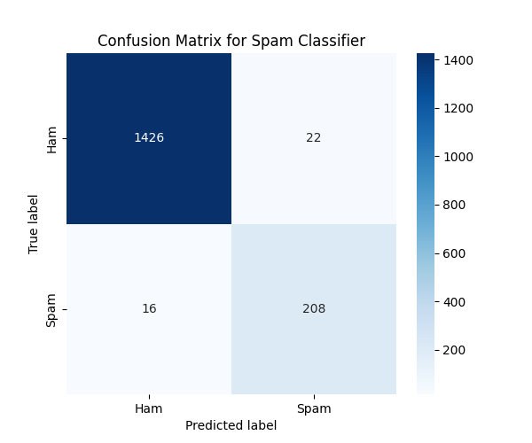

# 📧 Machine Learning Internship - Foundational Task 5: Spam Email Classifier

**Project Name:** `Cognetix_SpamClassifier`
**Internship Domain:** Machine Learning / Natural Language Processing (NLP)
**Organization:** Cognetix Technology

---

## 🎯 Objective

The objective of this project was to build a robust machine learning model capable of classifying text messages or emails as either **Spam (1)** or **Not Spam (Ham) (0)**. This task required the application of Natural Language Processing (NLP) techniques for text preprocessing and feature extraction.

## ⚙️ Functional Requirements & Key Steps

This project successfully addressed all functional requirements for the Spam Email Classifier task:

1.  **Data Preprocessing (NLP):** Implemented a cleaning pipeline to remove **punctuation** and **stopwords** (common English words) from the message text.
2.  **Feature Extraction:** Converted text data into numerical features using the **CountVectorizer** method.
3.  **Data Split:** Split the vectorized data into training and testing sets.
4.  **Model Training:** Trained a **Multinomial Naive Bayes (MNB)** classifier, which is highly effective for text classification.
5.  **Model Evaluation:** Evaluated performance using four key classification metrics.
6.  **Reporting:** Displayed a Confusion Matrix and Classification Report.
7.  **Real-time Prediction:** Implemented an **interactive terminal feature** to predict the classification of new, unseen messages entered by the user.

---

## 📊 Results and Performance (Multinomial Naive Bayes)

The Multinomial Naive Bayes model demonstrated extremely high performance, which is typical for this well-defined dataset when using CountVectorizer.

### Evaluation Metrics

| Metric | Value | Interpretation |
| :--- | :--- | :--- |
| **Accuracy Score** | **0.9832** | The model correctly classified 98.32% of the test messages. |
| **Precision Score** | **0.9575** | Of all messages predicted as SPAM, 95.75% were truly spam. |
| **Recall Score** | **0.9419** | The model successfully identified 94.19% of all actual spam messages. |
| **F1-Score** | **0.9496** | A strong, balanced metric confirming excellent performance on the spam class. |

### Confusion Matrix



The Confusion Matrix shows a high number of True Positives and True Negatives, with very few False Positives (Ham incorrectly flagged as Spam) or False Negatives (Spam incorrectly flagged as Ham).

---

## 🛠️ Technology Stack

* **Language:** Python
* **Data Manipulation:** Pandas
* **NLP:** NLTK (`stopwords`)
* **Feature Extraction:** Scikit-learn (`CountVectorizer`)
* **Machine Learning:** Scikit-learn (`MultinomialNB`)
* **Visualization:** Matplotlib, Seaborn
* **Dataset Source:** Kaggle SMS Spam Collection Dataset (`spam.csv`)

---

## 🚀 How to Run the Project (Interactive Mode)

1.  **Clone the Repository:**
    ```bash
    git clone [https://github.com/Hemavarni1501/Cognetix_SpamClassifier]
    cd Cognetix_SpamClassifier
    ```
2.  **Ensure Data is Present:** Verify that the **`spam.csv`** file is in the root directory.
3.  **Install Dependencies:**
    ```bash
    pip install pandas numpy scikit-learn matplotlib seaborn nltk
    # Download NLTK resources (only required once)
    python -c "import nltk; nltk.download('stopwords')"
    ```
4.  **Execute the Script:**
    ```bash
    python main.py
    ```
    *The script will train the model, print metrics, save the plot, and then launch the interactive predictor:*

    ```
    --- INTERACTIVE SPAM PREDICTOR ---
    Enter a message to classify (type 'quit' to exit).
    ==================================================
    Enter message: URGENT! Claim your free gift now!
    -> CLASSIFICATION: SPAM 🚨
    Enter message: Checking in on the meeting time.
    -> CLASSIFICATION: HAM ✅
    ```

---

# Project Done By

Hemavarni S